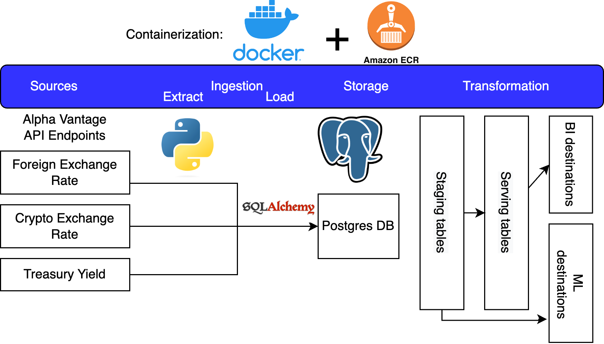

 
  

<h1 align="center"> <b> Financial Analytics ELT </b> </h1>
<h3 align="center"> Data Engineer Camp - Group Project #1 - Oct 2022 </h3>  

---

## Objective

This is a data engineering pipeline that extracts, loads and trasform multiple sets of economic and financial data from the [Alpha Vantage API](https://www.alphavantage.co/documentation/). 

The output of the pipeline could be used by data/business analysts, investment managers and other finance professionals, data and finance journalists alike, depending on the specific use case.

The data allows data analysts to investigate correlations and derive hypotheses on causation between those data points. These data points would also show the financial and economic changes coinciding with [black swan events](https://www.investopedia.com/terms/b/blackswan.asp) such as the outbreak of the COVID-19 pandemic in 2019 and Russia’s invasion of Ukraine in 2022.

## Source datasets

The pipeline currently contains the following datasets:

- [Foreign Exchange (FX) daily exchange rates](https://www.alphavantage.co/documentation/#currency-exchange) for different countires' currencies compared against the US Dollar. The crrent pipeline defaults to exchange rates against the AUD, EUR, JPY, RUB and GBP respectively.

- [Digital & Crypto Currencies daily exchange rates](https://www.alphavantage.co/documentation/#digital-currency) for for different digital currencies rates compared against the US Dollar. Current pipeline defaults to exchange rates against BTC, ETH and DOGE respectively.

- [US treasury yield data](https://www.alphavantage.co/documentation/#treasury-yield) for various maturity timelines. The current pipeline shows the maturify timelines for 3 months, 2 years, 5 years, 7 years and 10 years respectively.

## Architecture

- Object-oriented Python extraction using requests and pandas with integrated logging, testing, and yaml configuration for user input
- Upsert load to Postgress with sqlalchemy and database transformations using modularized sql with jinja templating
- Dockerizing and serving ELT pipeline on AWS with use of ECS, ECR, S3, RDS, and IAM

 
  

## Instructions

### Assumptions

* The pipeline can be forked and run locally as well as run via Docker. User knows how to set up and configure RDS, S3 and access control on AWS
### Preconditions
* creation of a Postgres database on AWS
* creation of an account on Alpha Vantage and obtain the API key via filling in [the form on this page](https://www.alphavantage.co/support/#api-key).
* S3 bucket with an env file 
  * Update the env file with details - api_key, target_db_user, target_db_password, target_db_server_name and target_db_database_name.
* Set up schedule to run container (Steps?)
### Steps
1. Complete preconditions
2. Connect reporting tools to RDS

